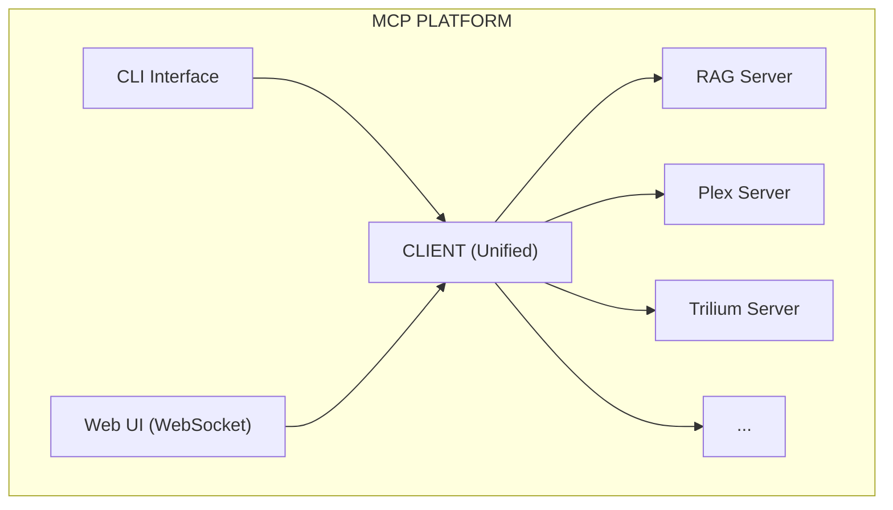

# MCP Platform Architecture

## High-Level Overview

This MCP platform is a **multi-agent orchestration system** that connects multiple MCP servers (RAG, Plex, Trilium, Code Assistant, etc.) through a centralized client with both CLI and web interfaces.



---

## 1. CLIENT ARCHITECTURE

The client is the orchestration layer that manages all MCP servers and routes requests.

```
┌─────────────────────────────────────────────────────────────────────────┐
│                           CLIENT LAYER                                  │
├─────────────────────────────────────────────────────────────────────────┤
│                                                                         │
│  ┌────────────────────────────────────────────────────────────────────┐ │
│  │                     INTERFACE LAYER                                │ │
│  ├────────────────────────────────────────────────────────────────────┤ │
│  │                                                                    │ │
│  │  ┌─────────────┐              ┌──────────────────────────┐         │ │
│  │  │     CLI     │              │   WebSocket Server       │         │ │
│  │  │    (REPL)   │              │   (web/index.html)       │         │ │
│  │  │             │              │                          │         │ │
│  │  │  - Commands │              │  - Real-time updates     │         │ │
│  │  │  - :model   │              │  - Streaming responses   │         │ │
│  │  │  - :stop    │              │  - Web UI integration    │         │ │
│  │  │  - :stats   │              │  - Chat interface        │         │ │
│  │  └──────┬──────┘              └───────────┬──────────────┘         │ │
│  │         │                                 │                        │ │
│  │         └─────────────┬───────────────────┘                        │ │
│  │                       │                                            │ │
│  └───────────────────────┼────────────────────────────────────────────┘ │
│                          │                                              │
│  ┌───────────────────────▼────────────────────────────────────────────┐ │
│  │                   ORCHESTRATION LAYER                              │ │
│  ├────────────────────────────────────────────────────────────────────┤ │
│  │                                                                    │ │
│  │  ┌───────────────────────────────────────────────────────────┐     │ │
│  │  │           Client.py (Main Entry Point)                    │     │ │
│  │  │                                                           │     │ │
│  │  │  - run_agent_wrapper() - Agent runner with multi-agent    │     │ │
│  │  │    support                                                │     │ │
│  │  │  - Multi-agent detection - Determines if multi-agent is   │     │ │
│  │  │    needed (eg. needs researcher agent)                    │     │ │
│  │  │  - Skills injection                                       │     │ │
│  │  │  - Conversation management - For the chat UI              │     │ │
│  │  └────────────────────┬──────────────────────────────────────┘     │ │
│  │                       │                                            │ │
│  │  ┌────────────────────▼────────────────────────────────────────┐   │ │
│  │  │         Distributed Skills Manager                          │   │ │
│  │  │                                                             │   │ │
│  │  │  - Skill discovery across servers                           │   │ │
│  │  │  - Forced skill patterns (GitHub review)                    │   │ │
│  │  │  - Keyword matching (find_relevant_skills) - needed for     │   │ │
│  │  │    weak models                                              │   │ │
│  │  │  - inject_relevant_skills_into_messages()                   │   │ │
│  │  └────────────────────┬────────────────────────────────────────┘   │ │
│  │                       │                                            │ │
│  └───────────────────────┼────────────────────────────────────────────┘ │
│                          │                                              │
│  ┌───────────────────────▼────────────────────────────────────────────┐ │
│  │                    LANGGRAPH LAYER                                 │ │
│  ├────────────────────────────────────────────────────────────────────┤ │
│  │                                                                    │ │
│  │  ┌────────────────────────────────────────────────────────────┐    │ │
│  │  │              LangGraph State Graph                         │    │ │
│  │  │                                                            │    │ │
│  │  │   START                                                    │    │ │
│  │  │     │                                                      │    │ │
│  │  │     ▼                                                      │    │ │
│  │  │  ┌─────────┐                                               │    │ │
│  │  │  │  agent  │  (call_model)                                 │    │ │
│  │  │  └────┬────┘                                               │    │ │
│  │  │       │                                                    │    │ │
│  │  │       ▼                                                    │    │ │
│  │  │  ┌─────────┐                                               │    │ │
│  │  │  │ router  │  (conditional routing)                        │    │ │
│  │  │  └────┬────┘                                               │    │ │
│  │  │       │                                                    │    │ │
│  │  │       ├────► tools ────► agent (loop)                      │    │ │
│  │  │       ├────► rag ──────► END                               │    │ │
│  │  │       ├────► ingest ───► END                               │    │ │
│  │  │       ├────► research ─► END                               │    │ │
│  │  │       └────► continue ─► END                               │    │ │
│  │  │                                                            │    │ │
│  │  └────────────────────────────────────────────────────────────┘    │ │
│  │                                                                    │ │
│  │  ┌────────────────────────────────────────────────────────────┐    │ │
│  │  │           INTENT_PATTERNS (Tool Routing)                   │    │ │
│  │  │                                                            │    │ │
│  │  │  Priority 2: High-priority patterns                        │    │ │
│  │  │    - ingest                                                │    │ │
│  │  │    - github_review                                         │    │ │
│  │  │    - code_assistant                                        │    │ │
│  │  │    - plex_search                                           │    │ │
│  │  │    - rag                                                   │    │ │
│  │  │    - trilium                                               │    │ │
│  │  │                                                            │    │ │
│  │  │  Priority 3: Standard patterns                             │    │ │
│  │  │    - location, weather, time                               │    │ │
│  │  │    - system, code, text                                    │    │ │
│  │  │    - ml_recommendation                                     │    │ │
│  │  │    - todo, knowledge, a2a                                  │    │ │
│  │  │                                                            │    │ │
│  │  │  Priority 10: General fallback                             │    │ │
│  │  │    - Returns all 75+ tools                                 │    │ │
│  │  └────────────────────────────────────────────────────────────┘    │ │
│  │                                                                    │ │
│  │  ┌────────────────────────────────────────────────────────────┐    │ │
│  │  │              Special Nodes                                 │    │ │
│  │  │                                                            │    │ │
│  │  │  research_node:                                            │    │ │
│  │  │    - Multi-source fetching                                 │    │ │
│  │  │    - URL detection & homepage handling                     │    │ │
│  │  │    - RAG ingestion of fetched content                      │    │ │
│  │  │    - Fallback chain: Direct → Ollama Search → LLM          │    │ │
│  │  │                                                            │    │ │
│  │  │  ingest_node:                                              │    │ │
│  │  │    - Plex media ingestion                                  │    │ │
│  │  │    - Batch processing with limits                          │    │ │
│  │  │    - Stop signal handling                                  │    │ │
│  │  │                                                            │    │ │
│  │  │  rag_node:                                                 │    │ │
│  │  │    - RAG search execution                                  │    │ │
│  │  │    - Context augmentation                                  │    │ │
│  │  └────────────────────────────────────────────────────────────┘    │ │
│  │                                                                    │ │
│  └────────────────────────────────────────────────────────────────────┘ │
│                                                                         │
│  ┌────────────────────────────────────────────────────────────────────┐ │
│  │                    SUPPORT SYSTEMS                                 │ │
│  ├────────────────────────────────────────────────────────────────────┤ │
│  │                                                                    │ │
│  │  ┌──────────────┐  ┌──────────────┐  ┌──────────────────────┐      │ │
│  │  │ Stop Signal  │  │ Search       │  │  Health Monitoring   │      │ │
│  │  │              │  │ Client       │  │                      │      │ │
│  │  │ - Global     │  │              │  │  - Tool call timing  │      │ │
│  │  │   flag       │  │ - Ollama     │  │  - Server health     │      │ │
│  │  │ - Async      │  │   Search API │  │  - Error tracking    │      │ │
│  │  │   checks     │  │ - Web search │  │  - Metrics           │      │ │
│  │  └──────────────┘  └──────────────┘  └──────────────────────┘      │ │
│  │                                                                    │ │
│  └────────────────────────────────────────────────────────────────────┘ │
│                                                                         │
│  ┌────────────────────────────────────────────────────────────────────┐ │
│  │                  MCP CLIENT (mcp_use)                              │ │
│  ├────────────────────────────────────────────────────────────────────┤ │
│  │                                                                    │ │
│  │  - Server discovery & initialization                               │ │
│  │  - Tool aggregation (75+ tools from 11 servers)                    │ │
│  │  - Session management                                              │ │
│  │  - Tool invocation (await session.call_tool)                       │ │
│  │                                                                    │ │
│  └────────────────────────────────────────────────────────────────────┘ │
│                                                                         │
└─────────────────────────────────────────────────────────────────────────┘
```

---

## 2. SERVER ARCHITECTURE

Each MCP server follows a consistent pattern with tools and skills.

```
┌─────────────────────────────────────────────────────────────────────────┐
│                      MCP SERVER (Generic Pattern)                       │
├─────────────────────────────────────────────────────────────────────────┤
│                                                                         │
│  ┌───────────────────────────────────────────────────────────────────┐  │
│  │                    SERVER INITIALIZATION                          │  │
│  ├───────────────────────────────────────────────────────────────────┤  │
│  │                                                                   │  │
│  │  server.py                                                        │  │
│  │    │                                                              │  │
│  │    ├─ Environment Check                                           │  │
│  │    │   └─ TRILIUM_URL, TRILIUM_TOKEN, etc.                        │  │
│  │    │   └─ Graceful degradation if missing                         │  │
│  │    │                                                              │  │
│  │    ├─ Logging Setup                                               │  │
│  │    │   └─ File: logs/server-name.log                              │  │
│  │    │   └─ Console output                                          │  │
│  │    │                                                              │  │
│  │    ├─ FastMCP Instance                                            │  │
│  │    │   └─ mcp = FastMCP("server-name")                            │  │
│  │    │                                                              │  │
│  │    └─ Skill Loader                                                │  │
│  │        └─ Load from skills/ directory                             │  │
│  │                                                                   │  │
│  └───────────────────────────────────────────────────────────────────┘  │
│                                                                         │
│  ┌───────────────────────────────────────────────────────────────────┐  │
│  │                         TOOLS LAYER                               │  │
│  ├───────────────────────────────────────────────────────────────────┤  │
│  │                                                                   │  │
│  │  @mcp.tool()                                                      │  │
│  │  @check_tool_enabled(category="server_name")                      │  │
│  │  def tool_name(params) -> str:                                    │  │
│  │      """                                                          │  │
│  │      Tool documentation with:                                     │  │
│  │      - Purpose                                                    │  │
│  │      - Args with types                                            │  │
│  │      - Returns (always JSON string)                               │  │
│  │      - Examples                                                   │  │
│  │      """                                                          │  │
│  │      # 1. Availability check                                      │  │
│  │      if not SERVER_AVAILABLE:                                     │  │
│  │          return json.dumps(error_response)                        │  │
│  │                                                                   │  │
│  │      # 2. Logging                                                 │  │
│  │      logger.info(f" [server] tool_name called")                   │  │
│  │                                                                   │  │
│  │      # 3. Business logic                                          │  │
│  │      result = do_work(params)                                     │  │
│  │                                                                   │  │
│  │      # 4. Return JSON                                             │  │
│  │      return json.dumps(result, indent=2)                          │  │
│  │                                                                   │  │
│  └───────────────────────────────────────────────────────────────────┘  │
│                                                                         │
│  ┌───────────────────────────────────────────────────────────────────┐  │
│  │                        SKILLS LAYER                               │  │
│  ├───────────────────────────────────────────────────────────────────┤  │
│  │                                                                   │  │
│  │  skills/                                                          │  │
│  │    ├─ skill_name.md                                               │  │
│  │    │   ├─ Metadata (YAML frontmatter)                             │  │
│  │    │   │   - name: skill_name                                     │  │
│  │    │   │   - description: When to use                             │  │
│  │    │   │   - tags: [search, notes, trilium]                       │  │
│  │    │   │   - tools: [tool1, tool2, tool3]                         │  │
│  │    │   │                                                          │  │
│  │    │   └─ Content (Markdown)                                      │  │
│  │    │       - Usage patterns                                       │  │
│  │    │       - Examples                                             │  │
│  │    │       - Best practices                                       │  │
│  │    │                                                              │  │
│  │    └─ Injected into system prompt when relevant                   │  │
│  │                                                                   │  │
│  │  Example Skills:                                                  │  │
│  │    - trilium_search.md                                            │  │
│  │    - trilium_manage.md                                            │  │
│  │    - trilium_navigate.md                                          │  │
│  │    - rag_status.md                                                │  │
│  │    - github_review.md                                             │  │
│  │                                                                   │  │
│  └───────────────────────────────────────────────────────────────────┘  │
│                                                                         │
│  ┌───────────────────────────────────────────────────────────────────┐  │
│  │                    HELPER FUNCTIONS                               │  │
│  ├───────────────────────────────────────────────────────────────────┤  │
│  │                                                                   │  │
│  │  - error_unavailable(): Standard error response                   │  │
│  │  - make_request(): HTTP client wrapper                            │  │
│  │  - parse_response(): Response handling                            │  │
│  │  - validate_input(): Input validation                             │  │
│  │                                                                   │  │
│  └───────────────────────────────────────────────────────────────────┘  │
│                                                                         │
│  ┌───────────────────────────────────────────────────────────────────┐  │
│  │                    META TOOLS                                     │  │
│  ├───────────────────────────────────────────────────────────────────┤  │
│  │                                                                   │  │
│  │  @mcp.tool()                                                      │  │
│  │  def list_skills() -> str:                                        │  │
│  │      """List all available skills for this server"""              │  │
│  │      return skill_registry.list()                                 │  │
│  │                                                                   │  │
│  │  @mcp.tool()                                                      │  │
│  │  def read_skill(skill_name: str) -> str:                          │  │
│  │      """Read full content of a skill"""                           │  │
│  │      return skill_registry.get_skill_content(skill_name)          │  │
│  │                                                                   │  │
│  └───────────────────────────────────────────────────────────────────┘  │
│                                                                         │
│  ┌───────────────────────────────────────────────────────────────────┐  │
│  │                   AUTO-DISCOVERY                                  │  │
│  ├───────────────────────────────────────────────────────────────────┤  │
│  │                                                                   │  │
│  │  if __name__ == "__main__":                                       │  │
│  │      # Auto-extract tool names                                    │  │
│  │      server_tools = get_tool_names_from_module()                  │  │
│  │                                                                   │  │
│  │      # Load skills                                                │  │
│  │      loader = SkillLoader(server_tools)                           │  │
│  │      skill_registry = loader.load_all(skills_dir)                 │  │
│  │                                                                   │  │
│  │      # Start server                                               │  │
│  │      mcp.run(transport="stdio")                                   │  │
│  │                                                                   │  │
│  └───────────────────────────────────────────────────────────────────┘  │
│                                                                         │
└─────────────────────────────────────────────────────────────────────────┘
```

---

## 3. SPECIFIC SERVER EXAMPLES

### RAG Server
```
┌─────────────────────────────────────────┐
│         RAG Server                      │
├─────────────────────────────────────────┤
│                                         │
│  Tools:                                 │
│    ✓ rag_search_tool                    │ 
│    ✓ rag_add_tool                       │
│    ✓ rag_status_tool                    │
│    ✓ rag_browse_tool                    │
│    ✓ rag_list_sources_tool              │
│    ✓ rag_diagnose_tool                  │
│                                         │
│  Skills:                                │
│    - rag_status.md                      │
│                                         │
│  Special Features:                      │
│    - Feedback system                    │
│    - Quality scoring                    │
│    - Auto-improvement triggers          │
│                                         │
└─────────────────────────────────────────┘
```

### Trilium Server
```
┌─────────────────────────────────────────┐
│       Trilium Server                    │
├─────────────────────────────────────────┤
│                                         │
│  Tools:                                 │
│    ✓ search_notes                       │
│    ✓ search_by_label                    │
│    ✓ get_note_by_id                     │
│    ✓ create_note                        │
│    ✓ update_note_content                │
│    ✓ update_note_title                  │
│    ✓ delete_note                        │
│    ✓ add_label_to_note                  │
│    ✓ get_note_labels                    │
│    ✓ get_note_children                  │
│    ✓ get_recent_notes                   │
│                                         │
│  Skills:                                │
│    - trilium_search.md                  │
│    - trilium_manage.md                  │
│    - trilium_navigate.md                │
│                                         │
│  Special Features:                      │
│    - ETAPI integration                  │
│    - Content/metadata separation        │
│    - Graceful degradation               │
│                                         │
└─────────────────────────────────────────┘
```

### Plex Server
```
┌─────────────────────────────────────────┐
│         Plex Server                     │
├─────────────────────────────────────────┤
│                                         │
│  Tools:                                 │
│    ✓ semantic_media_search_text         │
│    ✓ scene_locator_tool                 │
│    ✓ find_scene_by_title                │
│    ✓ plex_ingest_batch                  │
│    ✓ plex_ingest_items                  │
│    ✓ plex_find_unprocessed              │
│    ✓ ML recommendation tools (8)        │
│                                         │
│  Special Features:                      │
│    - Subtitle-based search              │
│    - ML recommender system              │
│    - Batch ingestion                    │
│    - Stop signal support                │
│                                         │
└─────────────────────────────────────────┘
```

---

## 4. DATA FLOW DIAGRAM

```
User Input
    │
    ▼
┌───────────────┐
│ CLI/WebSocket │ ◄─── User types: "Search my notes for leadership"
└───────┬───────┘
        │
        ▼
┌───────────────────────────────────────────────────────────────┐
│                   Client (client.py)                          │
│                                                               │
│  1. run_agent_wrapper()                                       │
│     - Checks multi-agent patterns                             │
│     - Calls distributed_skills_manager                        │
│                                                               │
│  2. distributed_skills_manager                                │
│     - is_general_knowledge()? → No                            │
│     - needs_tools()? → Yes                                    │
│     - find_relevant_skills("notes leadership")                │
│     - Injects: trilium_search.md into system prompt           │
│                                                               │
│  3. run_agent() with LangGraph                                │
└───────┬───────────────────────────────────────────────────────┘
        │
        ▼
┌───────────────────────────────────────────────────────────────┐
│                   LangGraph (langgraph.py)                    │
│                                                               │
│  1. call_model()                                              │
│     - match_intent("search my notes")                         │
│     - Matches: "trilium" pattern (priority 2)                 │
│     - Filters to 11 Trilium tools only                        │
│                                                               │
│  2. LLM Call with Filtered Tools                              │
│     - Model: qwen2.5:14b-instruct-q4_K_M                      │
│     - Decides: Call search_notes("leadership")                │
│                                                               │
│  3. router()                                                  │
│     - Sees tool_calls → Routes to "tools" node                │
└───────┬───────────────────────────────────────────────────────┘
        │
        ▼
┌───────────────────────────────────────────────────────────────┐
│                 Tool Execution                                │
│                                                               │
│  call_tools_with_stop_check()                                 │
│     - Extracts tool: search_notes                             │
│     - Calls: trilium_server via MCP                           │
└───────┬───────────────────────────────────────────────────────┘
        │
        ▼
┌───────────────────────────────────────────────────────────────┐
│              Trilium Server (server.py)                       │
│                                                               │
│  @mcp.tool()                                                  │
│  def search_notes(query="leadership", limit=50):              │
│     1. GET /etapi/notes?search=leadership                     │
│     2. For each result:                                       │
│        - GET /etapi/notes/{id}  (metadata)                    │
│        - GET /etapi/notes/{id}/content  (content)             │
│     3. Build response with previews                           │
│     4. Return JSON                                            │
└───────┬───────────────────────────────────────────────────────┘
        │
        ▼
┌───────────────────────────────────────────────────────────────┐
│                 Back to LangGraph                             │
│                                                               │
│  1. Receives ToolMessage with search results                  │
│  2. call_model() again to format results                      │
│  3. LLM generates natural language response                   │
│  4. router() → "continue" → END                               │
└───────┬───────────────────────────────────────────────────────┘
        │
        ▼
┌───────────────┐
│   Response    │
│   to User     │
└───────────────┘
```

---

## 5. TOOL ROUTING LOGIC

```
User Query: "Tell me about Autodesk"
    │
    ▼
┌─────────────────────────────────────────────────────────────┐
│            Pattern Matching (INTENT_PATTERNS)               │
├─────────────────────────────────────────────────────────────┤
│                                                             │
│  Priority 2 (checked first):                                │
│    ✗ ingest: No match                                       │
│    ✗ github_review: No match                                │
│    ✗ code_assistant: No match                               │
│    ✗ plex_search: No match                                  │
│    ✓ rag: Matches "tell me about" → Returns RAG tools       │
│                                                             │
│  Result: Filters to 6 RAG tools only                        │
└──────────────────────┬──────────────────────────────────────┘
                       │
                       ▼
              LLM sees only RAG tools
                       │
                       ▼
              LLM calls rag_search_tool
                       │
                       ▼
              Searches knowledge base
                       │
          ┌────────────┴────────────┐
          │                         │
      ✅ Found                ❌ Not Found
          │                         │
          ▼                         ▼
    Return results        (With feedback system)
                         Suggests: Try web search
```

---

## 6. OLLAMA SEARCH OVERRIDE

```
User: "Using Ollama Search, tell me about Revit"
    │
    ▼
┌─────────────────────────────────────────────────────────────┐
│              call_model() - EARLY OVERRIDE                  │
├─────────────────────────────────────────────────────────────┤
│                                                             │
│  Regex: OLLAMA_SEARCH_PATTERN.search(query)                 │
│    Matches: "using ollama search"                           │
│                                                             │
│  IMMEDIATELY:                                               │
│    1. Strip "using ollama search" from query                │
│    2. Call Ollama Search API                                │
│    3. Ingest results into RAG (if rag_add_tool available)   │
│    4. Pass results to LLM for formatting                    │
│    5. Return response                                       │
│                                                             │
│  BYPASSES:                                                  │
│    ✗ Pattern matching                                       │
│    ✗ Tool filtering                                         │
│    ✗ Skills injection                                       │
│    ✗ All other tools                                        │
│                                                             │
└─────────────────────────────────────────────────────────────┘
```

---

## 7. COMPLETE SYSTEM FLOW

```
┌─────────────────────────────────────────────────────────────────────┐
│                          STARTUP                                    │
├─────────────────────────────────────────────────────────────────────┤
│                                                                     │
│  1. Client starts                                                   │
│     ├─ Load .env (API keys, URLs, tokens)                           │
│     ├─ Initialize MCP client                                        │
│     ├─ Discover servers (11 servers)                                │
│     ├─ Connect to each server via stdio                             │ 
│     ├─ Aggregate tools (75+ tools total)                            │
│     └─ Initialize distributed_skills_manager                        │
│                                                                     │
│  2. Each server starts independently                                │
│     ├─ Check environment variables                                  │
│     ├─ Setup logging                                                │
│     ├─ Load skills from skills/ directory                           │
│     ├─ Register tools with FastMCP                                  │
│     └─ Listen on stdio for MCP requests                             │
│                                                                     │
│  3. LangGraph initializes                                           │
│     ├─ Load INTENT_PATTERNS                                         │
│     ├─ Create StateGraph with nodes                                 │
│     └─ Compile graph                                                │
│                                                                     │
└─────────────────────────────────────────────────────────────────────┘

┌─────────────────────────────────────────────────────────────────────┐
│                       REQUEST HANDLING                              │
├─────────────────────────────────────────────────────────────────────┤
│                                                                     │
│  User Query → CLI/WebSocket                                         │
│      ↓                                                              │
│  Client.py (run_agent_wrapper)                                      │
│      ├─ Check explicit tool name?                                   │
│      ├─ Check multi-agent patterns?                                 │
│      ├─ Inject skills (if relevant)                                 │
│      └─ Call run_agent()                                            │
│      ↓                                                              │
│  LangGraph (agent.ainvoke)                                          │
│      ├─ call_model()                                                │
│      │   ├─ Check Ollama Search override?                           │
│      │   ├─ match_intent() → Filter tools                           │
│      │   └─ LLM call with filtered tools                            │
│      ├─ router()                                                    │
│      │   ├─ tools? → Execute tools                                  │
│      │   ├─ research? → Fetch from sources                          │
│      │   ├─ ingest? → Batch ingest                                  │
│      │   └─ continue? → END                                         │
│      └─ Return final state                                          │
│      ↓                                                              │
│  Format response                                                    │
│      ├─ Extract AIMessage content                                   │
│      ├─ Handle markdown/formatting                                  │
│      └─ Send to CLI/WebSocket                                       │
│      ↓                                                              │
│  User sees response                                                 │
│                                                                     │
└─────────────────────────────────────────────────────────────────────┘
```

---

## 8. KEY ARCHITECTURAL PATTERNS

### 1. **Graceful Degradation**
- Servers check environment variables on startup
- Missing config → Server starts but tools return helpful errors
- No crashes, just reduced functionality

### 2. **Priority-Based Routing**
- Priority 2: High-value, specific patterns (RAG, Trilium, GitHub)
- Priority 3: Standard patterns (weather, time, system)
- Priority 10: General fallback (all tools)

### 3. **Skill Injection**
- Distributed across servers
- Injected into system prompt when relevant
- Contains best practices, examples, usage patterns

### 4. **Stop Signal**
- Global flag checked throughout execution
- Allows graceful cancellation of long-running operations
- Supported in both CLI and WebSocket

### 5. **Feedback Loop**
- Tools can return feedback requesting improvement
- Agent automatically retries with refinement
- Example: RAG low-quality results → Try web search

### 6. **Multi-Source Research**
- Detects source URLs in queries
- Fetches content from multiple sources
- Ingests into RAG for future use
- Falls back through: Direct → Ollama Search → LLM

---

## 9. TOOL STATISTICS

```
Total Servers: 11
Total Tools: 75+

Breakdown by Server:
  - RAG: 6 tools
  - Plex: 15 tools (including ML)
  - Trilium: 11 tools
  - Code Assistant: 10 tools
  - GitHub Review: 8 tools
  - System: 4 tools
  - Weather: 2 tools
  - Time: 1 tool
  - Location: 1 tool
  - Text Tools: 4 tools
  - A2A: 2 tools
  - Todo: 6 tools
  - Knowledge: 8 tools
```

---

## 10. PERFORMANCE CHARACTERISTICS

### Fast Operations (< 1 second):
- Simple tool calls (get_time, get_location)
- RAG status queries
- Note metadata retrieval

### Medium Operations (1-5 seconds):
- RAG searches
- Plex media searches
- Note creation/updates

### Slow Operations (5+ seconds):
- Batch ingestion (Plex)
- Multi-source research
- Note searches with content preview
- ML model inference

### Very Slow Operations (30+ seconds):
- Large batch processing
- Complex multi-agent workflows
- Comprehensive research with many sources

---

This architecture provides a **scalable, modular, and extensible** platform for multi-agent AI workflows with proper separation of concerns, graceful error handling, and intelligent tool routing.